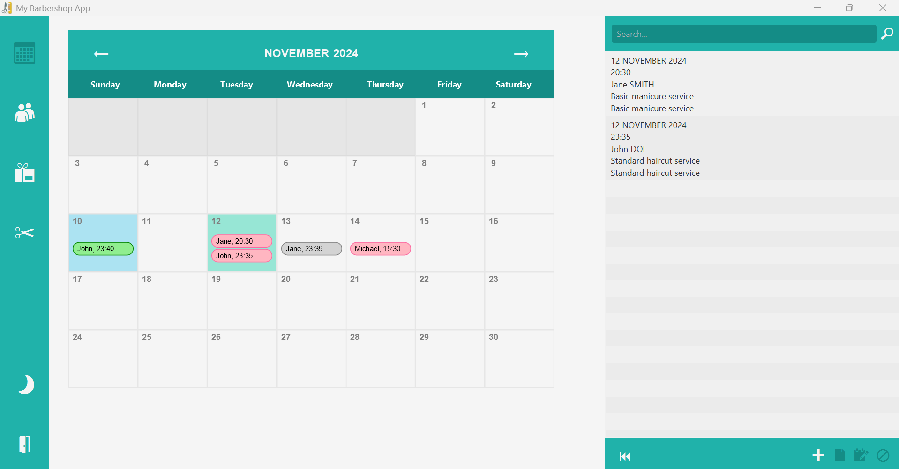
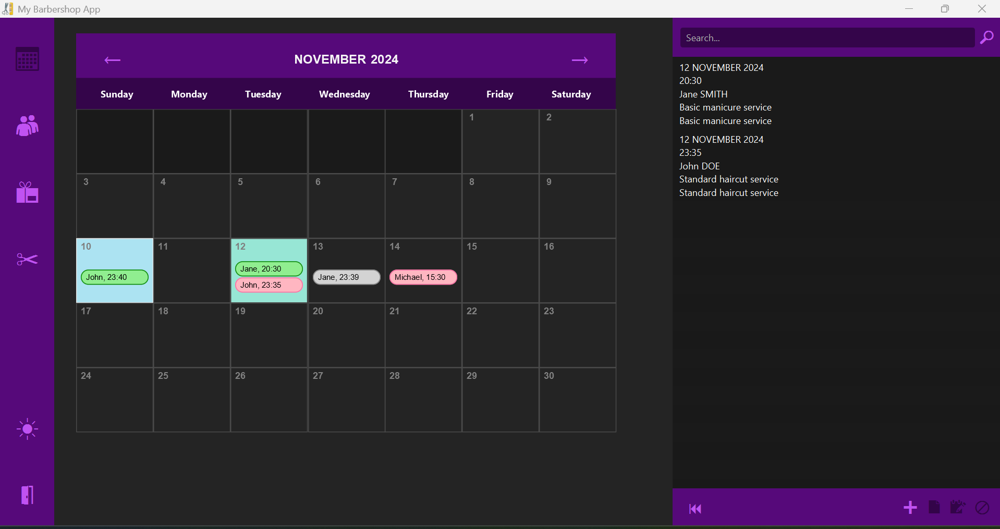
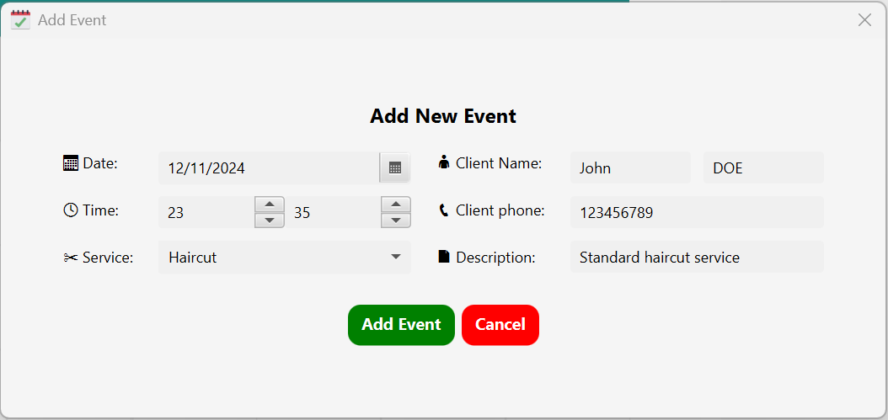
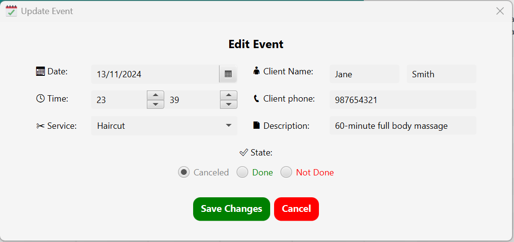
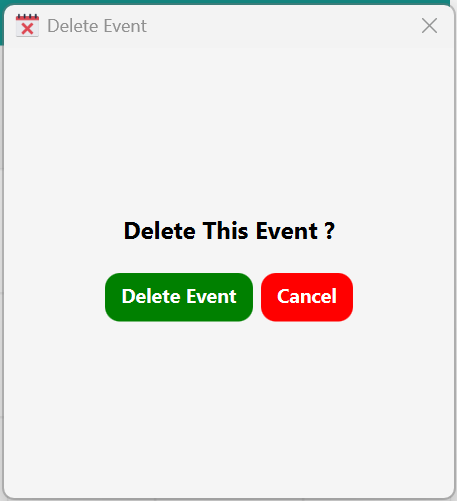
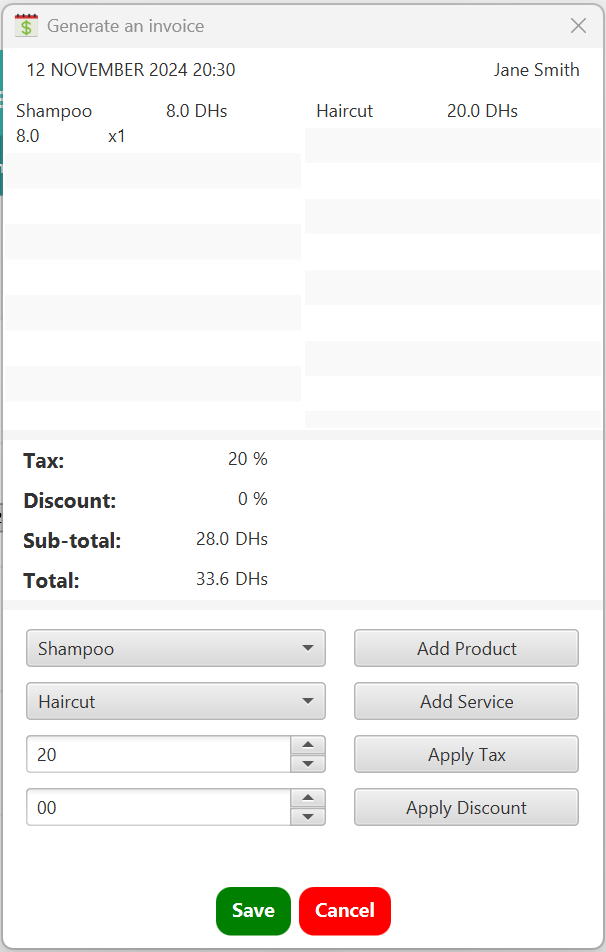
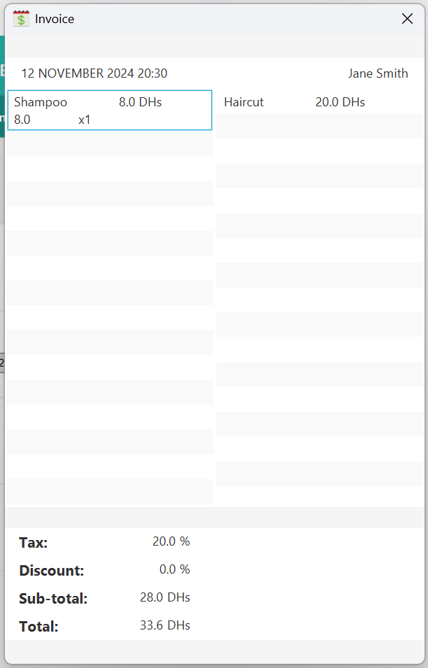

[](https://www.java.com) 
[](https://openjfx.io)
[](https://www.sqlite.org)

# BarberShop JavaFX App
### Requirements
The system aims to facilitate the management of appointments, transactions, products, services, invoices, and requisitions for a barber shop. 
It allows appointments scheduling, billing of services and products, management of inventory, and tracking of financial transactions.
### Entities
- **Client:** Represents customers who schedule appointments and receive invoices for services and products.
- **Service:** Describes the services offered by the business, including their name, code, description, price, and duration.
- **Product:** Represents the products available for sale, including their name, code, description, and price.
- **Invoice:** Represents the billing document issued to clients, including details such as the total cost, subtotal, tips, discount, tax rate, and balance due.
- **Appointment:** Represents scheduled appointments, including the date, time, requested service, and any additional notes.
- **Requisition:** Represents requests for products, including details such as the requisition number, requested date, received date, quantity received, and any notes.
### Data
The system stores data related to clients, services, products, invoices and appointments. 
This data includes client information, service and product details, invoice amounts and appointment schedules.

## Visuals
<div align="center">
  <a href="https://github.com/NiemaAM/BarberShop-JavaFX-App">
    
  </a>
  <a href="https://github.com/NiemaAM/BarberShop-JavaFX-App">
    
  </a>
  <br/>
  <a href="https://github.com/NiemaAM/BarberShop-JavaFX-App">
    
  </a>
  <a href="https://github.com/NiemaAM/BarberShop-JavaFX-App">
    
  </a>
  <a href="https://github.com/NiemaAM/BarberShop-JavaFX-App">
    
  </a>
  <br/>
  <a href="https://github.com/NiemaAM/BarberShop-JavaFX-App">
    
  </a>
  <a href="https://github.com/NiemaAM/BarberShop-JavaFX-App">
    
  </a>
</div>

## Run the project
You can run the project using the .jar file: [BarberShop.jar](https://github.com/NiemaAM/BarberShop-JavaFX-App/blob/main/BarberShop/BarberShop.jar.lnk)

## Project Structure
```bash
├── controllers
│   ├── alerts
│   ├── database
│   ├── patterns
│   └── style
├── models
│   ├── Client.java
│   ├── Event.java
│   ├── Invoice.java
│   ├── InvoiceProduct.java
│   ├── InvoiceService.java
│   ├── Product.java
│   └── Service.java
├── views
│   ├── calandar
│   ├── clients
│   ├── products
│   ├── services
│   └── Menu.java
├── App.java
└── Main.java
```

## Controllers & Models (Java)
[](https://www.java.com)
```bash
└── controllers
    ├── alerts
    │   ├── AlertController.java # control warrning, info and errors popups
    │   └── StockAlert.java # control low stock popups
    ├── database
    │   ├── DB.java # control database basic operations
    │   ├── GetData.java # fetch data from the database
    │   ├── AddData.java # add rows to the database
    │   ├── UpdateData.java # update rows on the database 
    │   └── DeleteData.java # delete rows from the database
    ├── patterns
    │   └── PaternController.java # control text patterns
    └── style
        ├── Colors.java # control the app colors and themes
        └── HoverController.java # control the button hovers
```
```bash
└── models
    ├── Client.java # client model
    ├── Event.java # event model
    ├── Product.java # product model
    ├── Service.java # service model
    ├── Invoice.java # invoice model
    ├── InvoiceProduct.java # invoice product model
    └── InvoiceService.java # invoice service model
```

## Views (JavaFx)
[](https://openjfx.io)
```bash
└── views
    ├── calandar
    │   ├── Calendar.java # calandar view
    │   ├── AddEvent.java # add new event view
    │   ├── EditEvent.java # edit event view
    │   ├── DeleteEvent.java- # delete event view
    │   ├── GenerateInvoice.java # generate an invoice view
    │   └── SeeInvoice.java # see an invoice view
    ├── clients
    │   ├── Clients.java # clients list view
    │   ├── AddClient.java # add new client view
    │   ├── EditClient.java # edit client view
    │   └── DeleteClient.java # delete client view
    ├── products
    │   ├── Products.java # products list view
    │   ├── AddProduct.java # add new product view
    │   ├── EditProduct.java # edit product view
    │   └── DeleteProduct.java # delete product view
    ├── services
    │   ├── Services.java # services list view
    │   ├── AddService.java # add new service view
    │   ├── EditService.java # edit service view
    │   └── DeleteService.java # delete service view
    └── Menu.java # side menu view
```
## Database (sql lite)
[](https://www.sqlite.org)
```sql
CREATE TABLE Client (
    client_id INTEGER PRIMARY KEY AUTOINCREMENT,
    first_name VARCHAR(255),
    last_name VARCHAR(255),
    phone INT
);

CREATE TABLE Event (
    event_id INTEGER PRIMARY KEY AUTOINCREMENT,
    date_time DATETIME,
    client_id INT,
    invoice_id INT,
    service_id INT,
    description TEXT,
    type INTEGER CHECK (type IN (0, 1, 2)),
    FOREIGN KEY (client_id) REFERENCES Client(client_id),
    FOREIGN KEY (invoice_id) REFERENCES Invoice(invoice_id),
    FOREIGN KEY (service_id) REFERENCES Service(service_id)
);

CREATE TABLE Invoice (
    invoice_id INTEGER PRIMARY KEY AUTOINCREMENT,
    client_id INT,
    appointment_id INT,
    sub_total DOUBLE,
    reductions DOUBLE,
    tax DOUBLE,
    total DOUBLE,
    FOREIGN KEY (client_id) REFERENCES Client(client_id),
    FOREIGN KEY (appointment_id) REFERENCES Event(event_id)
);

CREATE TABLE BillProduct (
    invoice_id INTEGER,
    product_id INTEGER,
    FOREIGN KEY (invoice_id) REFERENCES Invoice(invoice_id),
    FOREIGN KEY (product_id) REFERENCES Product(product_id)
);

CREATE TABLE BillService (
    invoice_id INTEGER,
    service_id INTEGER,
    FOREIGN KEY (invoice_id) REFERENCES Invoice(invoice_id),
    FOREIGN KEY (service_id) REFERENCES Service(service_id),
    PRIMARY KEY (invoice_id, service_id)
);

CREATE TABLE Product (
    product_id INTEGER PRIMARY KEY AUTOINCREMENT,
    name VARCHAR(255),
    description TEXT,
    quantity INT,
    price DOUBLE
);

CREATE TABLE Service (
    service_id INTEGER PRIMARY KEY AUTOINCREMENT,
    name VARCHAR(255),
    description TEXT,
    price DOUBLE
);
```